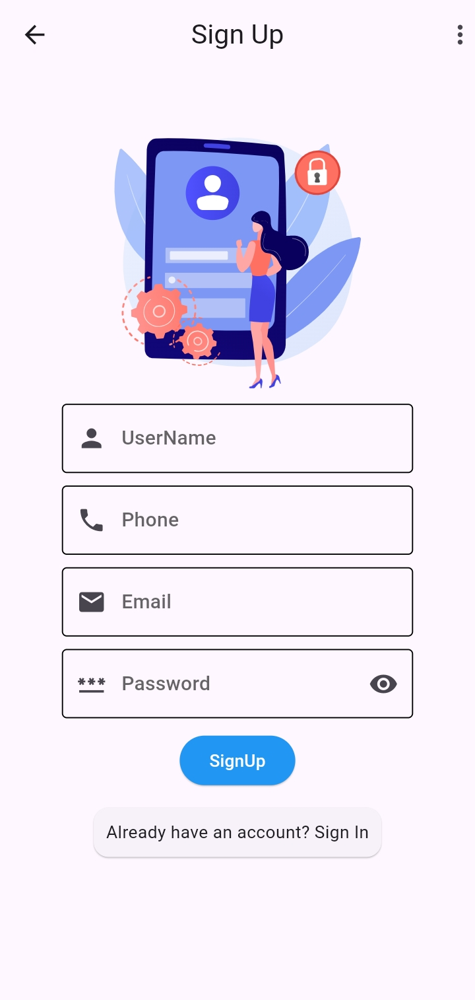
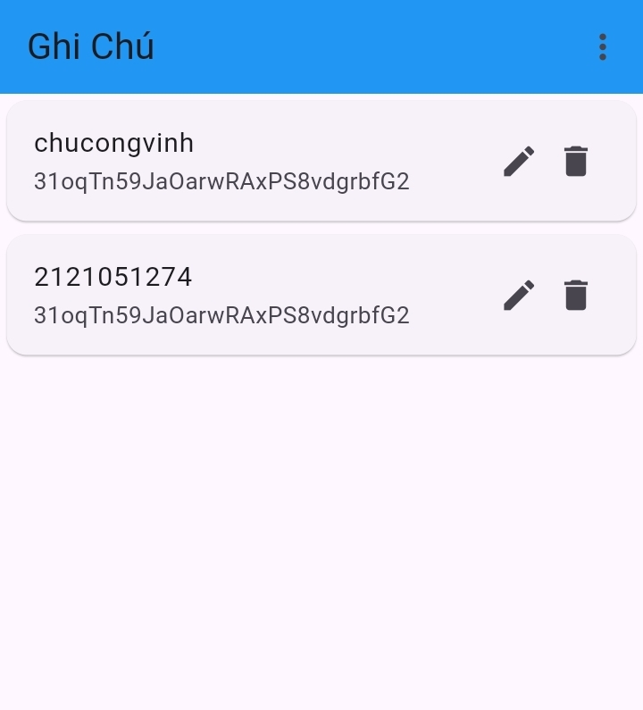
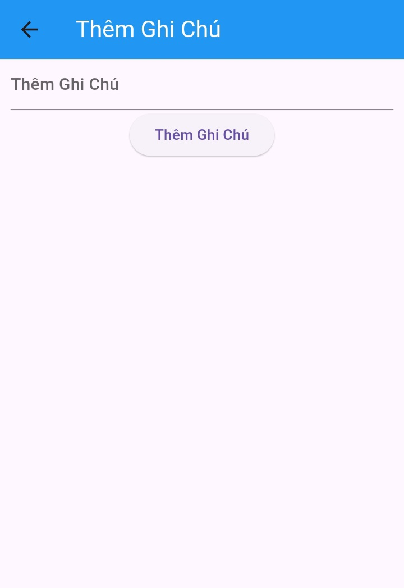
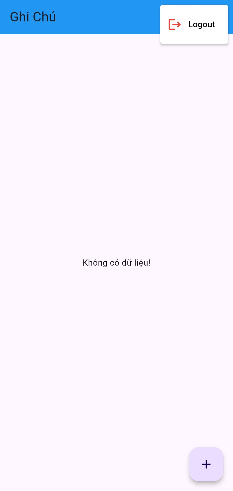

## Notes App 🐳

## 💡 Các chức năng

- [x] Đăng nhập và đăng kí bằng email và mật khẩu, quên mật khẩu
- [x] Tạo Notes
- [x] Sửa Notes
- [x] Xóa Notes
- [x] Đăng xuất

# 📸 Screenshots

| 1 | 2| 3|
|------|-------|
||||

| 4 | 5|
|------|-------|
|||


| 6 | 7|
|------|-------|
|||

## Cách cài đặt

1. Clone this repo:
   ```bash
   git clone https://github.com/vinhtb2003/app_ghi_chu.git
   ```

2. Mở thư mục dự án này bằng **VS Code**:
   ```bash
   cd app_ghi_chu
   ```

3.
   ```bash
   flutter upgrade
   ```

4.
   ```bash
   flutter pub get
   ```

5.
   ```bash
   flutter run
   ```

### Cấu trúc mã
>- |--assets
     - |--Animation:[text](<../Documents/flutter/app_ghi_chu/assets/Animation - 1717760988828.json>)
>- |--lib
>    - |-- service
       - |-- signUp_Service (đăng kí người dùng mới, lưu thông tin người dùng vào Firestore, sau đó điều hướng người dùng đến màn hình đăng nhập)
>    - |-- views
>      - |-- createNote_Screen.dart  (giao diện trang tạo notes)
>      - |-- editNote_Screen.dart ( giạo diện trang chỉnh sửa notes)
>       - |-- forgotPassword_Screen ( giao diện trang quên mật khẩu)
>      - |-- home_Screen.dart (giao diện hiển thị danh sách notes)  
>      - |-- login_Screen.dart  (giao diện trang đăng nhập)
>      - |-- signUp_Screen.dart  (giao diện trang đăng kí)
>    - |-- firebase_options
>    - |-- main.dart


